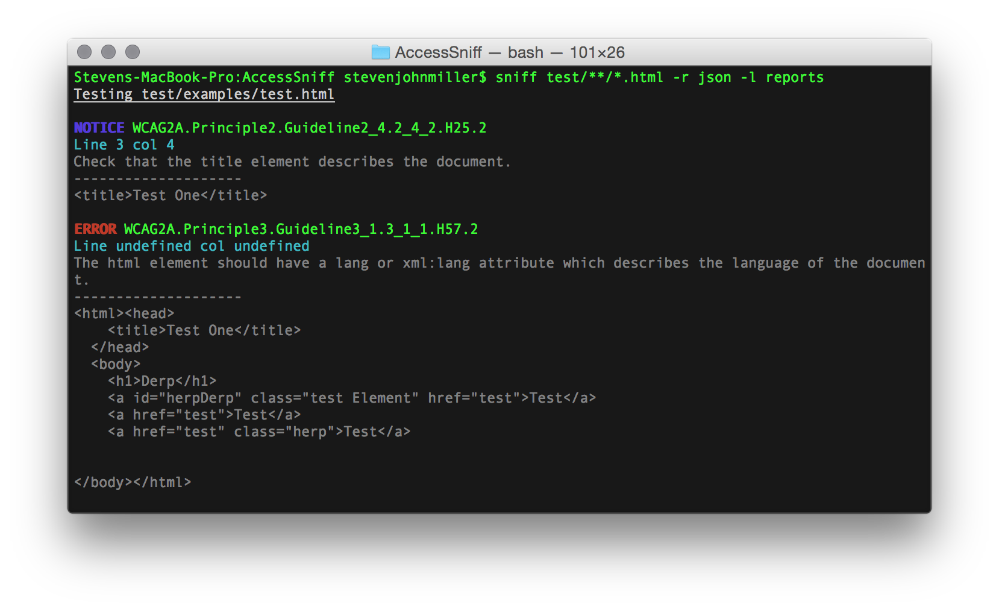

# AccessSniff
[](https://travis-ci.org/yargalot/AccessSniff)

A CLI and Phantom.js library for HTML_CodeSniffer

- [Gulp plugin](https://github.com/yargalot/gulp-accessibility)
- [Grunt plugin](https://github.com/yargalot/grunt-accessibility)



## Getting Started
Install this plugin with `npm install access-sniff` then use it in your project with

```javascript
var accessSniff  = require('access-sniff');
var files = ['**/*.html'];

accessSniff.start(files, options);
```

or install the module globally and type

```
sniff test/**/*.html -r json -l reports
```

## Options
You can pass some options

### Accessibility Level

```accessibilityLevel``` is a string

```javascript
  options: {
    accessibilityLevel: 'WCAG2A'
  }
```

Levels are ```WCAG2A```, ```WCAG2AA```, and ```WCAG2AAA```

### Accessibilityrc

```accessibilityrc``` is a boolean


```javascript
options: {
  accessibilityrc: true
}
```

Set to true to access a .accessibilityrc file in your project which should be layed out as:

```javascript
{
  "ignore": [
  "WCAG2A.Principle2.Guideline2_4.2_4_2.H25.1.NoTitleEl",
  "WCAG2A.Principle3.Guideline3_1.3_1_1.H57.2"
  ]
}
```


### Ignore

```ignore``` is a array

You can ignore rules by placing them in an array outlined below

```javascript
  options: {
    ignore : [
      'WCAG2A.Principle2.Guideline2_4.2_4_2.H25.1.NoTitleEl'
      'WCAG2A.Principle3.Guideline3_1.3_1_1.H57.2'
    ]
  }
```

### Report Type

```reportType``` is a string

```javascript
  options: {
    reportType: 'json'
  }
```

Text, CSV or JSON format output

- 'txt' will output text files
- 'json' will output .json files
- 'csv' will output csv

### Report Location

```reportLocation``` is a string

```javascript
  options: {
    reportLocation : 'reports'
  }
```

Set the value to where you want reports created

### Report Levels

`reportLevels` is a object

```javascript
  options: {
    reportLevels: {
      notice: true,
      warning: true,
      error: true
    }
  }
```

Set a value to ```false``` to limit output


### Verbose output

```verbose``` is a boolean

```javascript
  options: {
    verbose: false
  }
```

Output messages to console, set to true by default


### DomElement

``` domElement ``` is a boolean

```javascript
  options: {
    domElement: false
  }
```

Include reference (tag name, class names & id) to reported  elements. Optional for both output formats.

### Force

```force``` is a boolean

```javascript
  options: {
    force: true
  }
```

Continue running grunt in the event of failures


## CLI
You can use the CLI component by installing it globally with `npm install -g access-sniff`

```cmd
sniff test/**/*.html -r json -l reports
sniff test/**/*.html -r csv -l reports
sniff test/**/*.html -r txt -l reports
```

### Options

#### Report Type
`-r` or `-reportType`

txt, csv, json.

#### Report Location
`-r` or `-reportLocation`

#### Quiet
`-q` or `-quiet`
